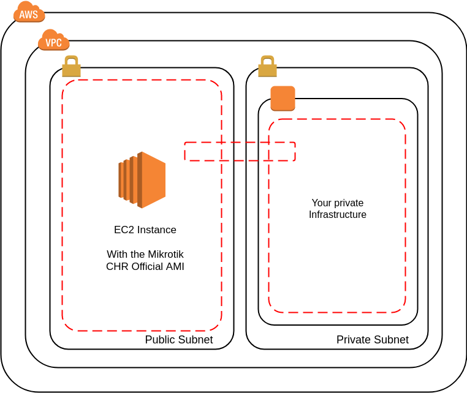

# Mikrotik Cloud Hosted Router
# Used as OpenVPN Server in Amazon Web Services

## Abstract

The idea of this repository is to test the _Mikrotik CHR (Cloud Hosted Router) AMI_ deployed on _Amazon EC2 Instance_.

To deploy the needed infrastructure _(VPC, subnets and EC2 Instace)_, I´m using _Terraform_ (0.11 version)

I configure the _Mikrotik_ via _Winbox_ and using the _SSH_ commands, the _Mikrotik_ it´s used as _VPN_ server with access to the private subnet (where the rest of your infrastructure are deployed)

## Network Diagram

- VPC
- Public Subnet, for the _Mikrotik_ Instance
- Private Subnet
- Security Group, with VPN access to the Mikrotik
- Allow traffic access to the private subnet
- The Ingress and Egress rules are deployed individually

## Tutorial?

Modules and variables explanation for the Terraform script

Configuring CHR as OpenVPN Server via Winbox

Configuring CHR as OpenVPN Server via Terminal Commands (using ssh)

## Thanks to

[Official Mikrotik CHR - Wiki Documentation](https://wiki.mikrotik.com/wiki/Manual:CHR)

[OpenVPN - Mikrotik Wiki](https://wiki.mikrotik.com/wiki/OpenVPN)

## LICENSE

All this repository are under [Attribution-ShareAlike 4.0 International (CC BY-SA 4.0) License](http://creativecommons.org/licenses/by-sa/4.0/).

You can see the [License](LICENSE.txt) file for more information.
